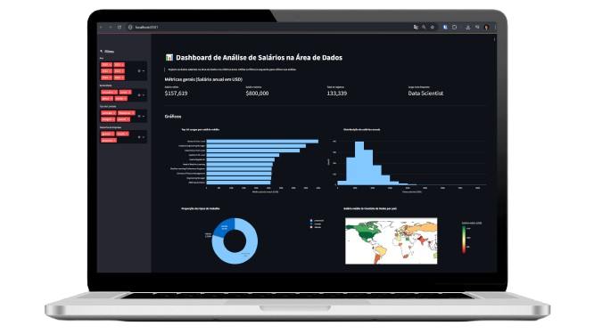
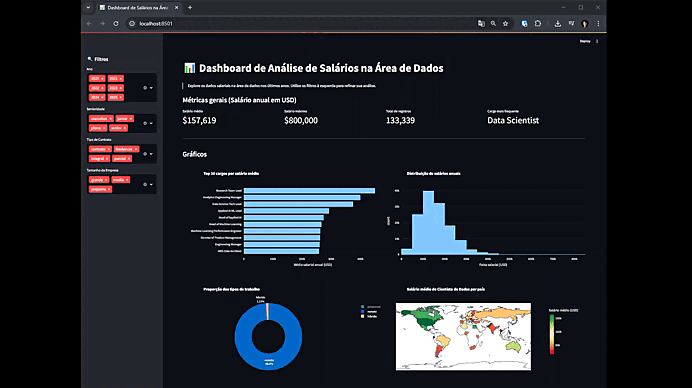
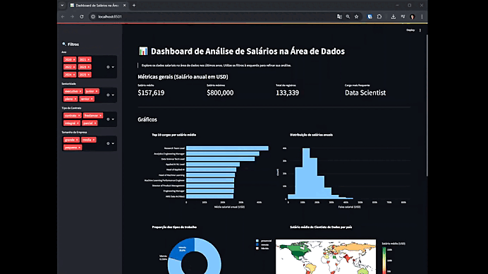
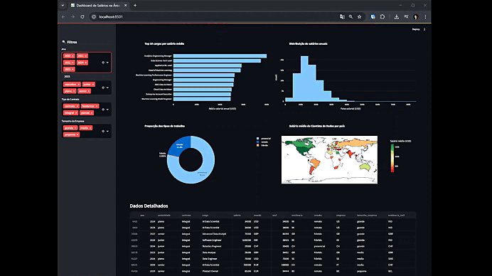

<!---------- Title/ Logo -------------->
<h1 align="center">
  
</h1>

<!-- ------- Ancoras --------------->
<p align="center">
  <a href="#-sobre">Sobre</a>&nbsp;&nbsp;&nbsp;|&nbsp;&nbsp;&nbsp;
  <a href="#-projeto">Projeto</a>&nbsp;&nbsp;&nbsp;|&nbsp;&nbsp;&nbsp;
  <a href="#-telas">Telas</a>&nbsp;&nbsp;&nbsp;|&nbsp;&nbsp;&nbsp;
  <a href="#-tecnologias">Tecnologias</a>&nbsp;&nbsp;&nbsp;|&nbsp;&nbsp;&nbsp;
  <a href="#-licença">Licença</a>
</p>

<!---------- Badges ----------------->
<p align="center">
  
  
  
  
  <!----(4953b8)--BlueDark -->
  <!----(49AA26)--Green -->
  <!----(008ed6)--Blue -->
  <!----(3292a6)--BlueMedium-->
  <!----(015F43)--GreenMedium-->
  <!----(8284FA)--purple-->
  <!----(5E60CE)--purpleDark-->
</p>

<br>
<!---------- showcase  ----------------->  
<p align="center">
  
</p>

 <!----- Acess Deploy Demonstration-->
 <h5 align="center">
    🎬 Clique Aqui: &nbsp; <a href="https://dashboard-dados-salarios-python-alxlima.streamlit.app/">  Visualizar Demonstração </a> 
 </h5 >


<!----- Description ------------------>
## 🔖 Sobre

&nbsp;&nbsp;&nbsp;&nbsp;Este projeto foi desenvolvido como parte do evento **Imersão Dados da Alura**, promovido pela [Alura Cursos](https://www.alura.com.br/).  
&nbsp;&nbsp;&nbsp;&nbsp;Foi uma semana intensa de estudos sobre **Python** e suas aplicações em análise de dados.

&nbsp;&nbsp;&nbsp;&nbsp;O projeto, denominado **Imersao-dados_python**, teve como objetivo a criação de um **dashboard interativo com gráficos**, explorando análise de dados em Python, utilizando as principais bibliotecas da linguagem.  
&nbsp;&nbsp;&nbsp;&nbsp;O sistema apresenta visualizações dinâmicas e manipuláveis, fornecendo **estatísticas** e **KPIs** a partir de dados extraídos de arquivos `.csv` hospedados em repositórios externos.

<br>

## 💻 Projeto

&nbsp;&nbsp;&nbsp;&nbsp;O desenvolvimento foi baseado em conceitos de **estruturas de dados** e no uso de bibliotecas essenciais como: **Pandas** e **plotly.express**. Para a camada de front-end, foi utilizado o **Streamlit**, permitindo a construção de um dashboard interativo.  

&nbsp;&nbsp;&nbsp;&nbsp;Durante a **Imersão Dados da Alura**, tive a oportunidade de aprofundar meus conhecimentos em **Python** e **Análise de Dados**, aprendendo na prática a coletar, tratar, manipular, analisar e visualizar informações.  
&nbsp;&nbsp;&nbsp;&nbsp;O projeto exemplifica, de forma prática, como criar visualizações de dados reais e desenvolver dashboards interativos, servindo como base sólida para ampliar meus conhecimentos nessas tecnologias.

<br>

 ###### **Evento :** Imersão Dados com Python - [Alura Cursos](https://www.alura.com.br/)
 ###### **Instrutor :** Equipe Alura
<br>

<!----- Showcase Screens Shot------------------>
## 💻 **Telas**

<div align="center">





</div>
<br>
<br>

<!----- Pré Requisitos ---------------------------->
## 🚀 Tecnologias

- [Python](https://www.python.org/) - Linguagem de programação utilizada para análise e manipulação de dados.
- [Pandas](https://pandas.pydata.org/) - Biblioteca Python para análise, manipulação e tratamento de dados.
- [Plotly Express](https://plotly.com/python/plotly-express/) - Biblioteca para criação de gráficos interativos e visualizações dinâmicas.
- [Streamlit](https://streamlit.io/) - Framework para construção de dashboards e aplicações web interativas em Python.
- [CSV](https://pt.wikipedia.org/wiki/Comma-separated_values) - Formato de arquivo utilizado como fonte de dados para análise.
- [VS Code](https://code.visualstudio.com/) - Editor de desenvolvimento utilizado para escrever e executar o código.

<br>


## 📝 Licença
<a href="https://opensource.org/licenses/MIT">
    
</a>

 &nbsp;&nbsp;&nbsp;&nbsp;Esse projeto está sob a licença MIT. Veja o arquivo [LICENSE](https://opensource.org/licenses/MIT) para mais detalhes.

 <br>

<!----- Configurations ---------------------------->
 ## 📌 Instruções : 

Para iniciar o Servidor da aplicação use o comando: **_streamlit run app.py_** então acesse pelo navegador **_http://localhost:8501_** 

<br>

## 📁 Como Baixar o Projeto

```bash
  # Clonar o repósitorio
  $ git clone https://github.com/alxlima/Imersao-Dados-Python.git

  # criar o ambiente virtual windows
  $ python -m venv .venv
  
  # Ativar ambiente virtual windows
  $ .venv\Scripts\Activate
  
  # Instalar as dependências
  $ pip install -r requirements.txt
  
  # Iniciar o Projeto
  $ streamlit run app.py
```
#
 Desenvolvido 🚀 por: ***_Alex Sandro da Silva lima_***


[](https://www.linkedin.com/in/alex-sandro-da-silva-lima-8b297839/) 
[](mailto:alex_lima2013@hotmail.com)

